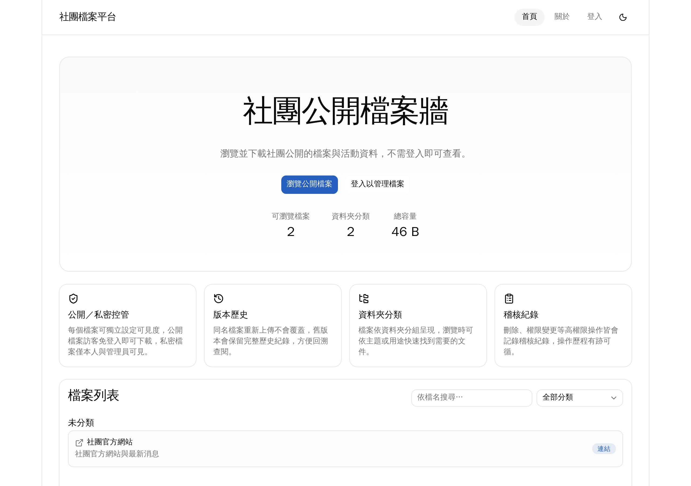
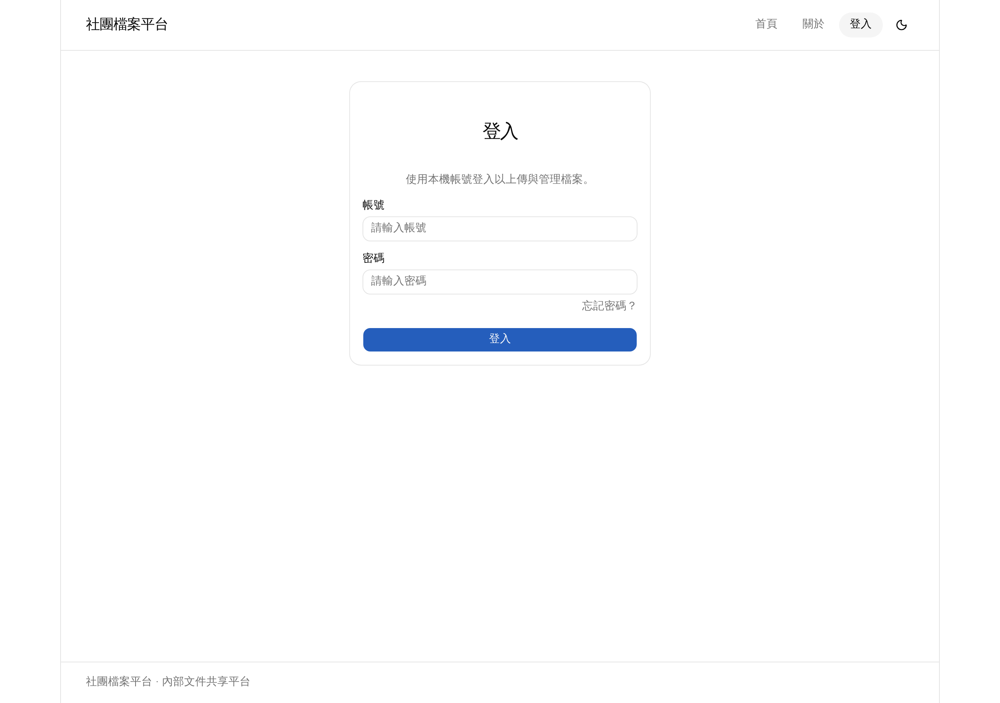
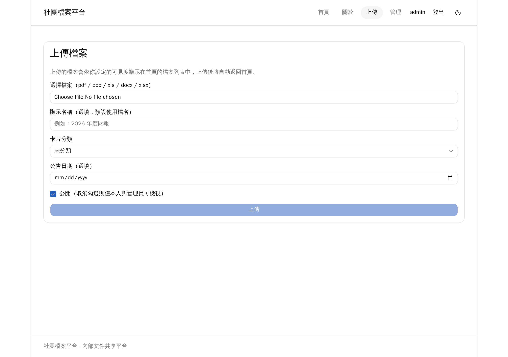
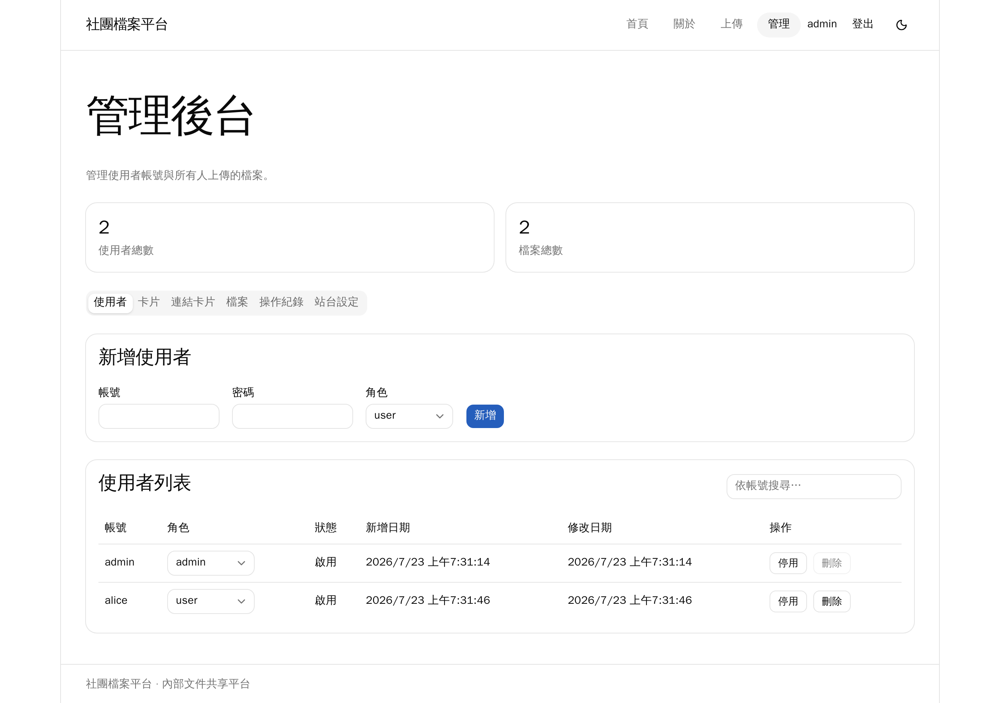
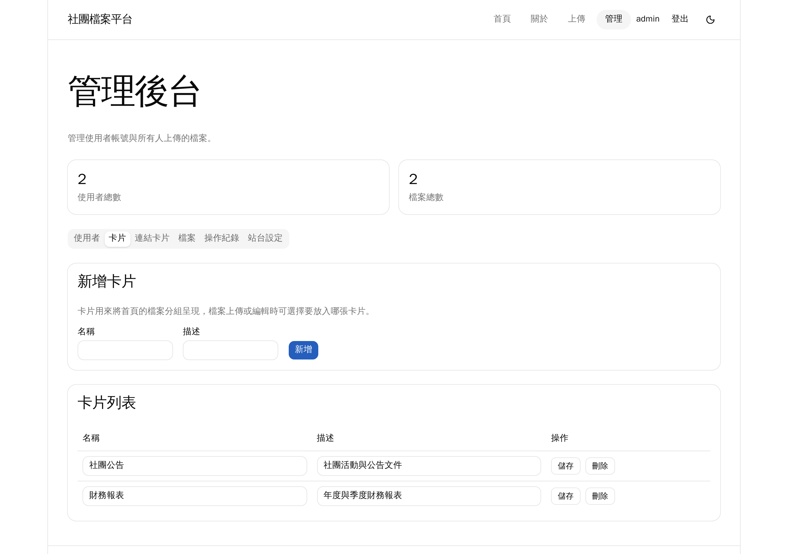
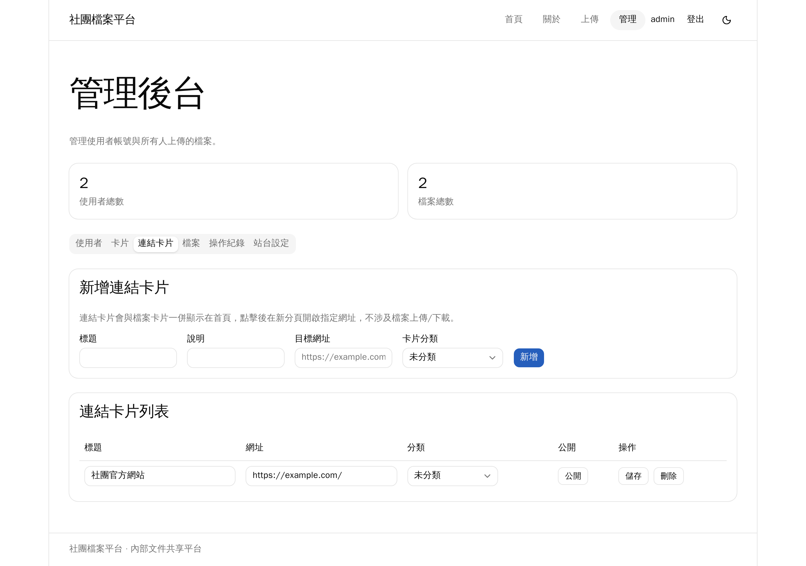
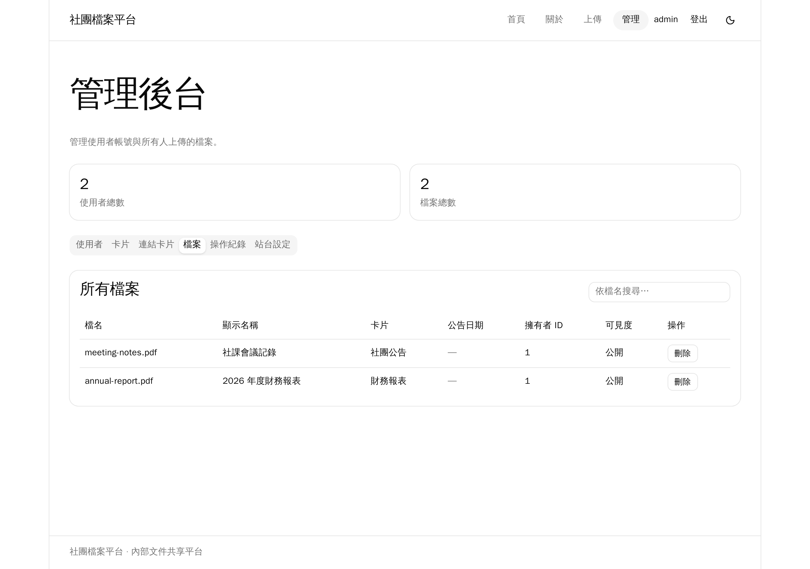
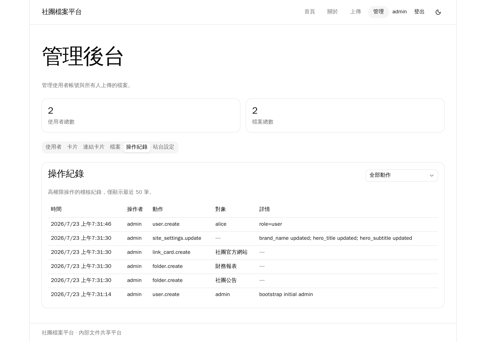
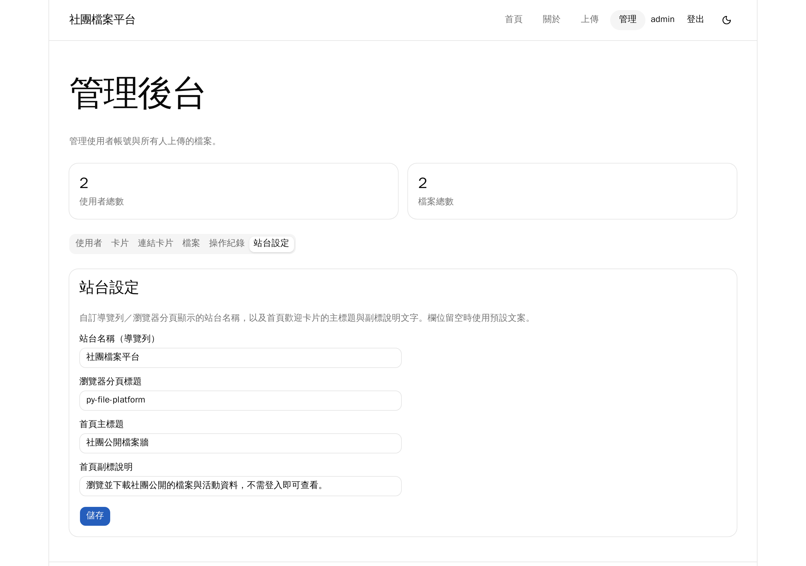

# py-file-platform

這是一個基於 Python 開發的檔案管理平台系統。
本專案的主要目的是測試 Python 在前後端互動中，處理資料「增刪查改 (CRUD)」與 API 的支援能力。

平台定位類似「社團／內部團隊」的公開文件分享空間（性質接近簡化版的 Facebook 貼文牆，但聚焦在檔案分享）：訪客無需登入，即可瀏覽並直接下載所有公開檔案；若要上傳或管理檔案，才需要登入帳號。

## 📸 畫面截圖 (Screenshots)

|                                                       |                                                         |
| ----------------------------------------------------- | ------------------------------------------------------- |
| **首頁公開檔案牆**（含檔案卡片與連結卡片分類）         | **登入頁**                                               |
|                      |                     |
| **上傳頁**                                             | **管理後台－使用者**                                     |
|                  |   |
| **管理後台－卡片**                                     | **管理後台－連結卡片**                                   |
|  |  |
| **管理後台－檔案**                                     | **管理後台－操作紀錄**                                   |
|   |  |
| **管理後台－站台設定**                                 |                                                           |
|  |                                                    |

## 🌟 專案特點

*   **身分驗證與權限分級**：支援使用者登入，帳號可由管理員建立，或串接 LDAP 進行驗證（LDAP 伺服器、帳密等設定可直接在管理後台網頁上設定，無需改動伺服器環境變數）。一般使用者可上傳與管理自己的檔案；管理員（Admin）擁有最高權限，可管理系統內所有使用者帳號（包含建立、編輯、停用、刪除其他使用者），並可檢視、管理所有使用者上傳的檔案。
*   **個人資料自助管理**：已登入使用者可自行修改顯示姓名，並在輸入目前密碼驗證後自行變更密碼；忘記密碼時仍可透過 Email 重設連結重設。
*   **檔案公開／私密設定**：使用者上傳檔案時可選擇公開（訪客可瀏覽下載）或私密（僅限本人與管理員檢視），滿足不想公開分享的檔案需求。
*   **檔案管理 API**：完整測試 Python 後端處理檔案上傳、讀取、更新與刪除的能力，並支援訪客直接下載公開檔案。
*   **檔案類型防護**：上傳檔案以常見辦公室文件為主（如 doc/docx、pdf、xls/xlsx 等），後端會進行副檔名／類型基本檢查，降低惡意檔案上傳風險。
*   **卡片分類瀏覽**：管理員可建立、編輯、刪除分類卡片（名稱、描述），檔案依卡片分組呈現，方便依部門或用途尋找檔案。
*   **檔案顯示名稱與公告日期**：檔案除了實際檔名外，可另外設定顯示名稱與公告日期，方便在清單中呈現（不影響實際檔名與下載內容）。
*   **版本歷史**：同名檔案上傳時不覆蓋舊檔，保留版本歷史，可回溯查看／下載先前版本。
*   **上傳通知**：公開檔案上傳成功後，廣播站內通知給其他使用者，並在使用者有設定 Email 時非同步寄送通知信；私密檔案不通知，避免洩漏其存在。
*   **Email SMTP 設定**：寄送重設密碼信、上傳通知信所使用的 SMTP 伺服器、帳密等設定，可直接在管理後台網頁上設定，無需改動伺服器環境變數；未啟用或未設定時，信件內容僅會寫入後端日誌，方便本機開發測試。
*   **檔案儲存**：檔案實體存放於伺服器本機檔案系統，資料庫僅儲存檔案 metadata。
*   **檔案大小限制**：上傳檔案設有大小上限，避免磁碟空間被過大檔案佔滿。
*   **操作稽核紀錄（Audit Log）**：記錄管理員的高權限操作（如建立/停用/刪除使用者帳號、刪除他人檔案等），包含操作者、時間、對象與動作內容，以利事後追溯。
*   **前後端分離測試**：驗證前端與 Python 後端 API 的資料對接與傳輸效率。

## 🛠️ 技術棧 (Tech Stack)

*   **後端 (Backend)**: Python / FastAPI
*   **前端 (Frontend)**: React + TypeScript + Vite，UI 使用 Tailwind CSS v4 + shadcn（`base-nova`
    style，元件基底為 `@base-ui/react`）+ `lucide-react` 圖示，樣式組合用
    `class-variance-authority` / `tailwind-merge`
*   **資料庫 (Database)**: PostgreSQL

## 🧑‍💻 本機執行方式 (Local Development)

### 前置準備

複製環境變數範本並依需要調整：

```bash
cp .env.example .env
```

`.env` 放在專案根目錄（不是 `backend/` 底下），前後端與 `docker-compose` 都共用同一份設定。

### 後端 (backend)

需先啟動一個 PostgreSQL（例如用 `docker compose up db`），再執行：

```bash
cd backend
source venv/bin/activate   # venv 已存在，以 uv 建立、Python 3.12

alembic upgrade head       # 套用資料庫 migration
uvicorn app.main:app --reload   # 開發模式啟動，預設 http://localhost:8000
```

原生開發（uvicorn 跑在 host，db 在 Docker）時，`.env` 的 `DATABASE_URL` 要用 `localhost`。

### 前端 (frontend)

```bash
cd frontend
npm install
npm run dev   # Vite dev server，預設 http://localhost:5173
```

### 使用 Docker Compose 一次啟動全部服務

```bash
docker compose up --build
```

會啟動三個 service：`db`（postgres:16-alpine）、`backend`（container 啟動時自動跑 `alembic upgrade
head` 再啟動 uvicorn，`:8000`）、`frontend`（Vite dev server，`:5173`）。此模式下 backend 讀取的
`DATABASE_URL` 會由 `docker-compose.yml` 覆寫為指向 `db` 這個 service。`./uploads` 會掛載進
backend container，確保上傳檔案在容器重建後仍保留。

## ✅ 測試 (Testing)

### 後端

```bash
cd backend
source venv/bin/activate
pytest
```

### 前端

```bash
cd frontend
npm test        # vitest run
npm run lint    # oxlint
```

## 📦 發布模式執行方式 (Production / Release Mode)

`docker compose up`（即 `docker-compose.yml`）啟動的 frontend container 內部是跑 `npm run dev`
（Vite dev server），只適合開發用途。正式環境改用獨立的 `docker-compose.prod.yml`（**不要**跟
`docker-compose.yml` 疊加使用，兩者的 frontend/nginx 服務會同時啟動）：內含 db／backend／nginx 三個
service，用 nginx（`nginx/nginx.conf`）取代 Vite dev server，直接靜態伺服 `frontend/dist/` 並將
`/api/` 轉發給 backend，對外只暴露一個 port（80）。

### 1. 建置前端靜態檔案

```bash
cd frontend
npm run build     # tsc -b && vite build，輸出到 frontend/dist/
```

`docker-compose.prod.yml` 會把 `frontend/dist/` 以唯讀 volume 掛進 nginx container，所以每次改動前端
程式碼後，部署前都要重新執行這個步驟。

> 建置時**不要**設定 `VITE_API_BASE_URL`（開發用的 `.env` 只給 `npm run dev` 用）。這個情境下前端與
> 後端是同一個 nginx origin，API client 沒抓到這個變數時會 fallback 成相對路徑 `/api/...`，直接交由
> nginx 的 `location /api/` 轉發即可；若建置時不小心帶了開發用的 `http://localhost:8000`，前端會跳過
> nginx 直接打 8000 port，但 `docker-compose.prod.yml` 並未對外開放該 port，會直接連線失敗。

### 2. 啟動 db／backend／nginx

```bash
docker compose -f docker-compose.prod.yml up --build -d
```

- `nginx` service：監聽 `:80`，靜態伺服 `frontend/dist/`；`location /api/` 轉發給 `backend:8000`；
  非 `/api` 且非實際靜態檔案的路徑一律 fallback 回 `index.html`（支援 `react-router-dom` 的
  client-side routing，重新整理 `/admin` 等子路徑不會 404）。
- `backend`／`db` 不再對外暴露 port（`8000`／`5432`），只能透過 docker 內部網路被 `nginx` 存取，
  對外僅開放 80。
- backend container 啟動時一樣會自動跑 `alembic upgrade head`（見 `backend/Dockerfile`）。

若需要調整 backend 的 worker 數／monitoring，修改 `backend/Dockerfile` 的啟動指令即可；此設定原本
就不含 `--reload`，可直接用於正式環境。

## 🚀 部署 (Deployment)

*   **部署方式**：以 Docker 容器化部署，FastAPI（後端）、React（前端）、PostgreSQL（資料庫）分別建立 container，並以 docker-compose 統一管理；本機檔案系統的上傳目錄需掛載為 volume，避免容器重建時資料遺失。
*   **存取範圍**：僅限內部網路存取，不對外公開。
*   **資料備份**：每日執行一次自動備份，資料庫以 `pg_dump` 匯出、檔案上傳目錄以 `tar`/`rsync` 打包，備份結果傳送至內部 NAS／其他主機（避免與正式主機同時故障導致備份一併遺失），並保留最近 30 天的備份、超過天數自動清除舊備份。

## 📄 授權條款 (License)

本專案採用 [MIT License](LICENSE) 授權。

